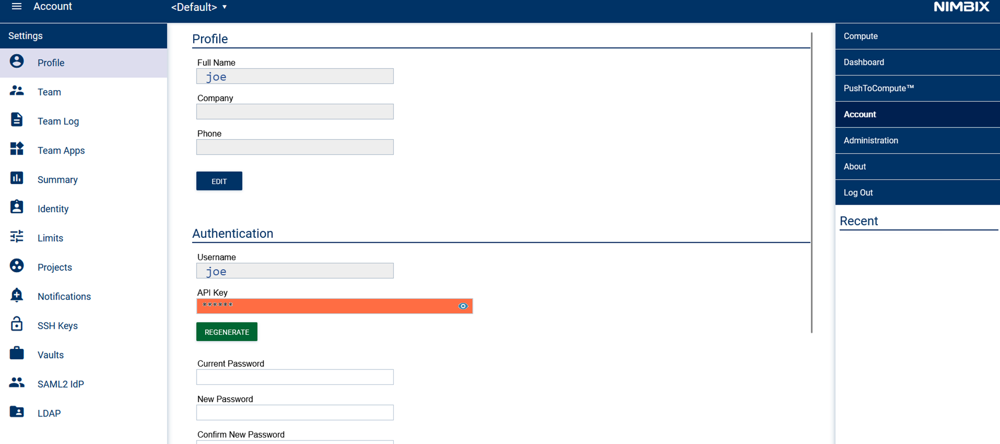

# nf-jarvice

This plugin has been made to submit Nextflow pipelines into a Jarvice cluster.

## Requirements

User must have a Jarvice cluster `username` and its associated `apikey`.

To retrieve account API key, from portal, go into **Account** on the right side, and get apikey by clicking on the eye in the API key field.



Jobs must then be submitted from a folder shared as persistent vault into the cluster (files transfer is not supported for now).

Best solution if vault is not available outside of the cluster is to launch an interactive shell into an `n0` class node. Then ensure current working directory is under `/data` (which is the default persistent vault folder), then pull nextflow tool, add it to current PATH, add Jarvice settings, and execute the pipeline.

## Example

We will assume user is already connected to a Jarvice cluster, via an interactive `n0` node.

```
cd /data
mkdir mytest
cd mytest
git clone https://github.com/nextflow-io/nextflow
export PATH=/data/mytest/nextflow:$PATH
```

In order to use the plugin, user must provide the following information into the `nextflow.config` file of the project. Create file `/data/mytest/nextflow.config` with the following content:


```
plugins {
  id 'nf-jarvice@0.6.0'
}
process {
    executor = 'jarvice'
    container = 'us-docker.pkg.dev/jarvice/images/ubuntu-desktop:bionic'
    apiUrl = 'https://cloud.nimbix.net/api'
    machineType = 'n0'
    vault {
        name = 'persistent'
        readonly = false
        force = false
    }
    user {
        username = 'myusername'
        apikey = 'XXXXXXXXXXXXXXXXXXXXXXXXXXXX'
    }
}
```

Replace apiUrl, machineType, vault, and user (username and apikey) with your Jarvice user values and desired target machines.

Container value can be let as it, since it should be defined per steps in the nextflow pipeline file.

Now upload your nextflow pipeline file and data. For this example, create file `test.nf` with the following content:

```
// Declare syntax version
nextflow.enable.dsl=2

process update_message {
  container 'us-docker.pkg.dev/jarvice/images/ubuntu-desktop:bionic'
  machineType 'n1'

  output:
    path "top_hits.txt"

    """
    #!/usr/bin/env bash
    pwd
    echo Step 1
    echo "Smooth Criminal" > top_hits.txt
    """
}

process add_date {
  container 'us-docker.pkg.dev/jarvice/images/ubuntu-desktop:bionic'
  machineType 'n1'

  input:
    path top_hits

  output:
    path "sequences.txt"

    """
    echo Step 2
    echo \$(cat top_hits.txt) \$(date) > sequences.txt
    """
}

workflow {
   update_message | add_date | view
}
```

And launch it using:

```
nextflow run test.nf
```

Jarvice plugin will automatically be downloaded and used as executor. Jobs can be seen in Jarvice portal, like any other jobs.